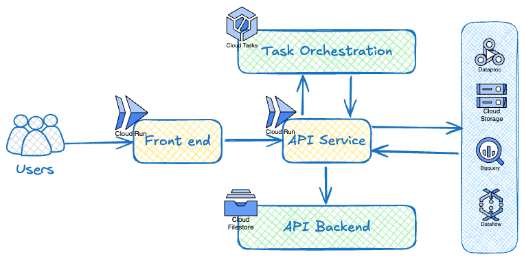
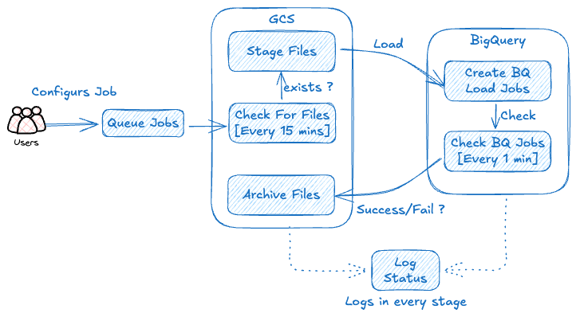

# GCP Task Orchestration

An orchestration platform for Google Cloud workflows with an admin UI to monitor job execution and manage jobs. It exposes a REST API to accept job requests, track execution in Firestore, and enqueue tasks with Cloud Tasks.

[](https://github.com/paragpratim/gcp-task-orchestration/actions/workflows/go-ci.yml)

[](https://github.com/paragpratim/gcp-task-orchestration/actions/workflows/deploy-terraform.yml)

[](https://github.com/paragpratim/gcp-task-orchestration/actions/workflows/deploy-task-orchestration-app.yml)

## What this repo contains

- `orchestrator-service/` — Go-based service that exposes a REST API, stores job status in Firestore, and enqueues Cloud Tasks work.
- `orchestrator-ui/` — Node.js/React dashboard for submitting jobs and monitoring execution.
- `terraform/` — infrastructure as code for GCP resources.
- `docker-compose.yml` — local emulators for Firestore and Cloud Tasks, plus the API and UI.

## Architecture



## Features

### Versions

- V1 — GCS-to-BigQuery ingestion workflow using Cloud Tasks, Firestore tracking, and a monitoring UI.



## Local development

Ensure Docker and Task are installed locally. The development setup uses Firestore and Cloud Tasks emulators so the API and UI can run without a full GCP deployment.

### Quick start

```bash
task up
```

This starts the local stack.

- API Swagger UI: http://localhost:8080/swagger/swagger-ui/index.html
- UI: http://localhost:3000

Useful commands:

```bash
task down
task test
task build
task swagger
```

## Repo layout

```text
.
├── docker-compose.yml
├── Taskfile.yml
├── orchestrator-service/
├── orchestrator-ui/
├── terraform/
└── README.md
```

## Notes

- Local development uses Firestore and Cloud Tasks emulators.
- Production deployment is managed through Terraform and the Go service configuration.
- Swagger documentation is available under `orchestrator-service/docs`.
